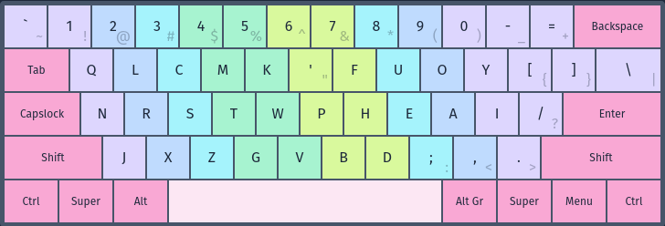

# Pine Layout - Version 4


### Introduction
This is the fourth version in the Pine layout series. After a long hiatus from testing layouts, I revisted version 3 of Pine and made some adjustments, and I stumbled upon this configuration of letters which I found to be very comfortable even after months of use.

### Differences from Pine V3
The main difference between V3 and V4 is that V4 flattens out the left hand by removing the RN stack. I use a dynamic typing style and I found that I would often need to press R with ring instead of middle to burst words effectively at high speeds. This pattern of use required my hand to contort in an uncomfortable way. To fix this pattern, I split up R + N, and moved Y over to the right hand to accommodate the changes. This change results in more natural finger patterns when burst typing.

### Design
Pine V4 was created using a mix of generation and hand-optimization. It was balanced for various stats:
- low same-finger use
- low lateral stretches
- low scissors
- low redirects

Additionally it was tailored to fit my own personal preferences:
- low bottom row use
- low upper-left pinky use

### Variants
- V4 is easily angle-moddable by moving GV to the left and putting Z on index.
- W or V can be swapped with Z for a heavier middle at the cost of additional scissors.

### Matrix
Here's the layout in ascii form so you can copy/paste it.
```
q l c m k ' f u o y
n r s t w p h e a i /
j x z g v b d ; , .
```

### Contact
If you have any questions about Pine V4 or alt layouts in general, feel free to join the [discord server](https://discord.gg/RuhfchQC).
